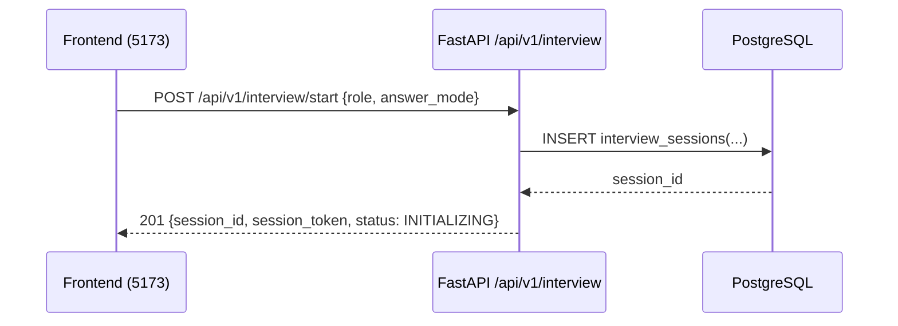
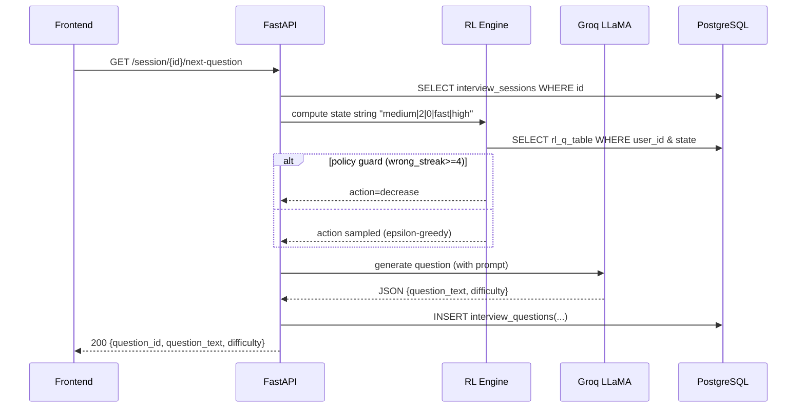
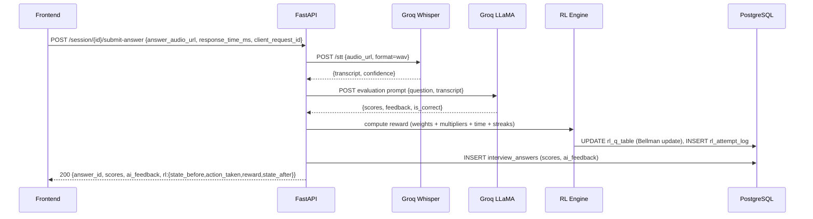
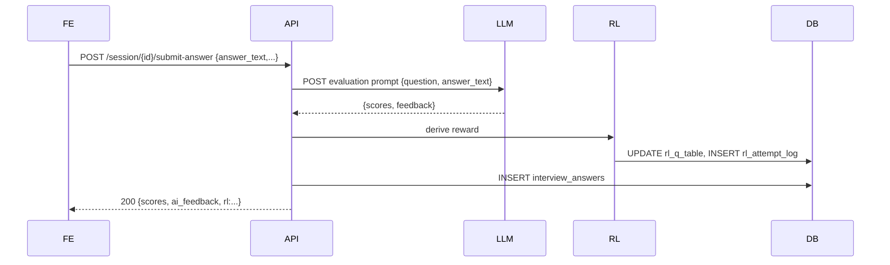
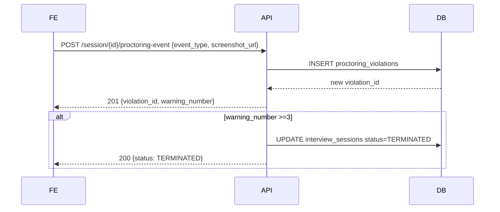
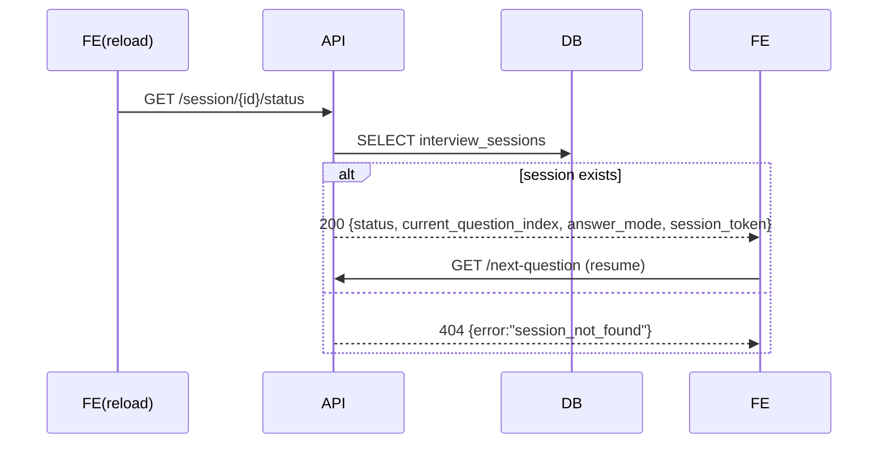
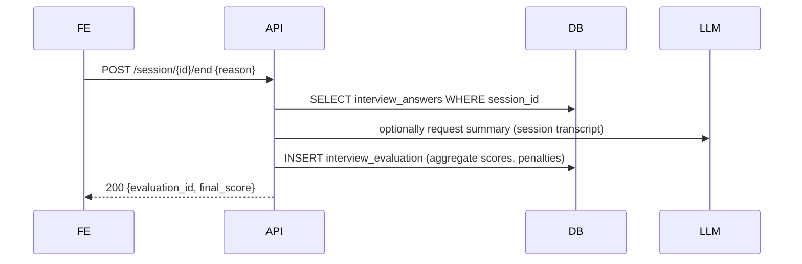
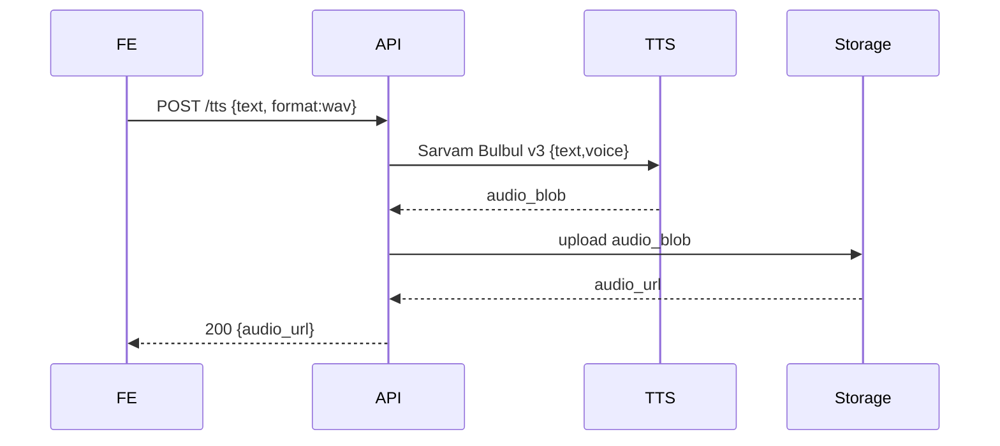

# IntelliHire — Interview Sequence Diagrams (Mermaid)

## 1. Start Interview

## 2. Get Next Question (with RL engine flow)

## 3. Submit Voice Answer (STT → evaluate → RL update)

## 4. Submit Text Answer (evaluate → RL update)

## 5. Proctoring Event

## 6. Browser Refresh / Session Resume

## 7. End Interview + Trigger Evaluation

## 8. TTS Playback Flow

