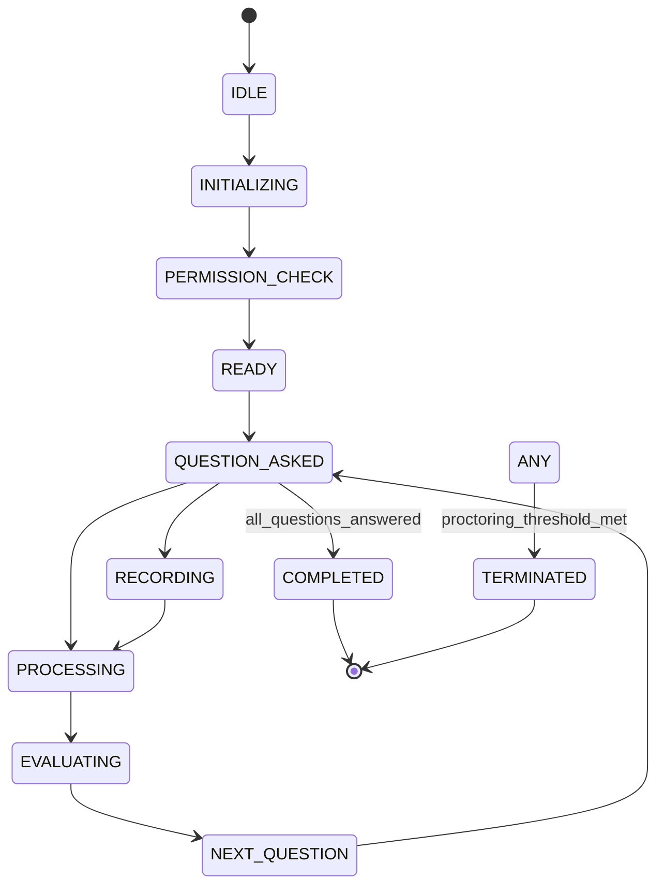

# IntelliHire — Interview State Machine

## All States (with description)
- IDLE: Session stub created, awaiting initialization.
- INITIALIZING: Backend preparing resources, RL lookup, and permission handshake.
- PERMISSION_CHECK: Frontend requesting webcam/mic permissions.
- READY: Candidate can begin; session initialized and first question ready.
- QUESTION_ASKED: Question displayed; awaiting candidate answer.
- RECORDING: Candidate is recording audio input.
- PROCESSING: Upload/stt processing in progress.
- EVALUATING: LLM evaluating answer and RL performing updates.
- NEXT_QUESTION: Backend preparing next question and updating `current_question_index`.
- COMPLETED: Interview finished normally; final evaluation written.
- TERMINATED: Interview forcibly ended due to policy or admin action.

## All Transitions (from → to + trigger)
- IDLE → INITIALIZING: POST /start accepted.
- INITIALIZING → PERMISSION_CHECK: backend signals frontend to request permissions.
- PERMISSION_CHECK → READY: all required permissions granted or fallbacks chosen.
- READY → QUESTION_ASKED: GET /next-question returns question.
- QUESTION_ASKED → RECORDING: user starts audio recording (voice mode).
- QUESTION_ASKED → PROCESSING: user submits text answer (text mode) or stops recording.
- RECORDING → PROCESSING: recording stopped; upload initiated.
- PROCESSING → EVALUATING: STT completes or text received; LLM evaluation initiated.
- EVALUATING → NEXT_QUESTION: evaluation done; RL update done.
- NEXT_QUESTION → QUESTION_ASKED: next-question provided to frontend.
- ANY STATE → TERMINATED: proctoring warnings >=3 or manual admin termination.
- ANY STATE → COMPLETED: user triggers POST /end or last question answered.

## State Diagram

## Invalid Transitions (what must never happen)
- `COMPLETED` → `QUESTION_ASKED`: once completed, no more questions.
- `RECORDING` → `READY`: cannot jump back to `READY` without processing.
- `QUESTION_ASKED` → `QUESTION_ASKED` with decreased `current_question_index`: index must never decrease.
- `easy`→`hard` immediate jump in RL action selection is forbidden (enforced in RL policy guard).

## State Persistence (which states are saved to DB)
- `interview_sessions.status` persisted on every transition.
- `current_question_index` persisted after `NEXT_QUESTION`.
- `warning_count` persisted on proctoring events.
- `last_activity_at` updated on major transitions (submit, next-question).
- `interview_answers` persisted at `EVALUATING` completion.
- `rl_attempt_log` persisted after RL updates.

## Frontend vs Backend State Sync Rules
- Backend is authoritative for state. Frontend sends events to update but must poll `GET /session/{id}/status` after transitions.
- Frontend may optimistically show UI changes (e.g., start recording), but must reconcile with backend on success/failure RPC responses.
- On mismatch (e.g., frontend shows `RECORDING` but backend status is `TERMINATED`), frontend must show modal and sync state via `GET /status`.
